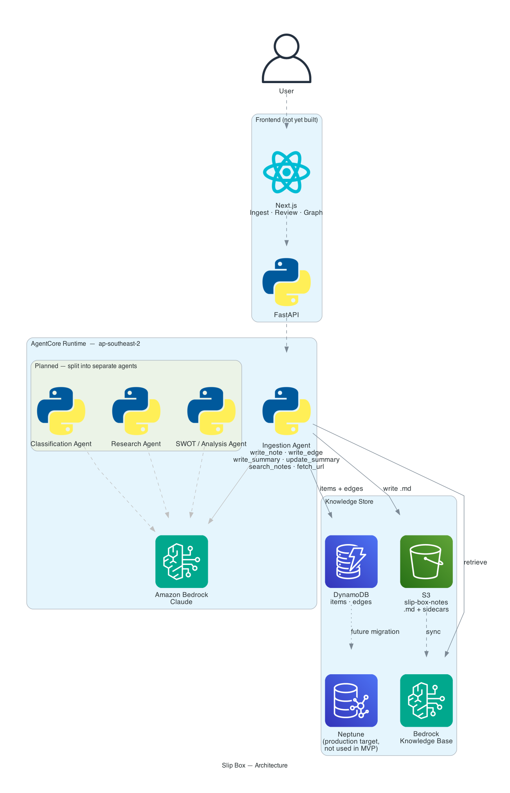

# CLAUDE.md

This file provides guidance to Claude Code (claude.ai/code) when working with code in this repository.

## Project Overview

Slip Box is a multi-agent "second brain" built with the AWS Strands Agents SDK and hosted on AgentCore Runtime. It ingests sources (articles, YouTube, PDF, plain text), classifies typed relationships between them (SUPPORTS / CONTRADICTS / EXTENDS), and maintains a graph of those connections in Amazon Neptune. All edges are auto-written; confidence score is stored as metadata and surfaced visually in the graph (low-confidence edges render differently) so the user can correct anything they disagree with.

Architecture and design decisions live in this file (below) and in [`docs/build-log.md`](docs/build-log.md) (chronological). The original hackathon pitch/submission strategy is in [`docs/hackathon-pitch.md`](docs/hackathon-pitch.md). AgentCore config and CLI reference is in [`AGENTS.md`](AGENTS.md).

## Project Structure

```
slip-box/
├── agentcore/           # AgentCore config and CDK (managed by agentcore CLI)
├── app/MyAgent/         # Strands agent code — main.py is the entrypoint
├── docs/                # Design docs, build log, diagrams
│   └── diagrams/        # Generated architecture diagram(s)
├── scripts/             # Standalone utility scripts (backfill, diagram generation)
├── AGENTS.md            # AgentCore CLI and schema reference
└── CLAUDE.md            # This file
```

## Environment Setup

Dependencies are managed with `uv`. The virtual environment lives in `app/MyAgent/.venv`.

```bash
cd app/MyAgent
uv sync
```

AWS credentials must have Bedrock model invocation permissions.

## Commands

```bash
# Local development (hot-reload + browser inspector)
agentcore dev

# Deploy agent code + AgentCore resources
agentcore deploy

# Deploy application infrastructure (S3, DynamoDB, Neptune later)
# Run from agentcore/cdk/ — builds TypeScript then deploys SlipBox-App-* stack
cd agentcore/cdk && npm run deploy:app

# Invoke deployed agent
agentcore invoke --prompt "Hello"

# Validate agentcore config
agentcore validate

# Add a resource (memory, agent, gateway, etc.)
agentcore add <resource>
```

Run agentcore commands from the repo root. The agentcore CLI reads `agentcore/agentcore.json` for config.

`npm run deploy:app` compiles TypeScript then deploys the `SlipBox-App-*` stack. npm scripts automatically resolve `cdk` from `node_modules/.bin`, so no global CDK install is needed.

## Agent Code

`app/MyAgent/main.py` is the Strands agent wrapped in `BedrockAgentCoreApp` for AgentCore Runtime hosting:

- `BedrockAgentCoreApp()` — the hosting wrapper; handles HTTP serving and session isolation
- `@app.entrypoint` — called by AgentCore on each invocation (replaces direct `agent(message)` calls)
- `tools = []` — add custom `@tool` functions and community tools here
- `agent.stream_async` — streaming response back to caller
- Session management — LRU cache (128 sessions) keyed by `session_id`; resets on cold start

Custom tools follow the same pattern as standard Strands: `@tool` decorator, typed args, docstring for the tool schema.

**Default build type is CodeZip** (source packaged as zip, no Docker required). Container build is opt-in via `agentcore.json`.

## Architecture



*Solid lines are live today; dashed/dotted are planned (frontend, split-out agents, Neptune). Regenerate with `uv run python scripts/generate_architecture_diagram.py` (run from `app/MyAgent/` so it picks up the venv) after any change to what's actually wired up.*

### Multi-agent design

Four separate Strands agents — not one mega-prompt:

| Agent | Role |
|---|---|
| Ingestion agent | Extract, summarize, embed incoming source |
| Classification agent | Propose and score edge type (SUPPORTS/CONTRADICTS/EXTENDS) |
| Research agent | Outward search/fetch fan-out (`--research` mode only) |
| SWOT/analysis agent | Cluster synthesis and analysis |

Review Strands multi-agent primitives (Agent-as-Tool, Swarm, A2A) before wiring these together.

### Two-tier ingestion

- **Default path:** ingest → write `.md` to S3 → trigger KB sync → semantic retrieval → classification → write to DynamoDB + Neptune
- **`--research` flag:** same, but triggers the research agent to fan out before classification

### Confidence and edge correction

- Classification agent scores each proposed edge with a confidence value (0–1).
- **Threshold (`EDGE_CONFIDENCE_THRESHOLD` in `app/MyAgent/config.py`, default 0.65):** edges at or above threshold are written to Neptune; edges below are dropped entirely — no queue, no noise.
- Confidence is stored as metadata on the Neptune edge and in the `.md.metadata.json` sidecar.
- In the graph view, edges near the threshold render differently (dashed line / muted colour) so the user can spot and correct anything they disagree with inline.
- All edges are user-editable/deletable from the graph view; append-only `history` log per edge for provenance.
- To re-examine dropped connections, the user can ask the agent "what else is this connected to?" and classification reruns on demand.

**Connections live on the card, matching the original method** (Luhmann's notes carried references to other notes on the card itself, not in a separate index):
- Connections are written into the note's own frontmatter (not the body) as typed link lists (`supports`, `contradicts`, `extends`, `related_to`) using `[[wikilinks]]`, so Obsidian's graph/backlinks picks them up. Regenerated from Neptune's current edge state on every change, never appended. Body stays pure prose; frontmatter is system-generated — no clobbering risk.
- Excluded from KB embedding like the rest of frontmatter; mirrored into `.md.metadata.json` for KB filtering.
- **Neptune stays the source of truth for the graph** — S3 is source of truth for note content, frontmatter connections are a generated reflection, never authored directly.

### Storage

- **S3** — source of truth. Each ingested item is written as an atomic `.md` file with YAML frontmatter (source, date, confidence scores, relationship metadata). Human-readable, portable, enables Obsidian sync via `aws s3 sync`.
- **Bedrock Knowledge Base** — syncs from S3, creates embeddings for semantic retrieval. Indefinite persistence (no expiry). Replaces AgentCore Memory which has a hard 365-day cap incompatible with a permanent second brain.
  - The `.md.metadata.json` sidecar is a **Bedrock KB requirement**, not an application choice — the KB reads it during S3 sync to treat those fields (type, source, date, tags) as filterable metadata rather than embedding them as content. Without it, frontmatter bleeds into the embedding and degrades retrieval. The KB cannot read DynamoDB; the sidecar cannot be eliminated.
  - Keep the sidecar minimal: only the fields the KB needs for filtering. Full metadata lives in DynamoDB.
  - Use hierarchical/semantic chunking (not default fixed-size) for longer literature notes so retrieval doesn't cut mid-section.
- **DynamoDB** — `items` table (structured metadata for all note types: `literature-note`, `permanent-note`) and `edges` table (`from_id`, `to_id`, `type`, `confidence`, `history`). Neptune is the production graph target but DynamoDB covers all MVP query needs (write edge, read edges by node, read all edges for graph render) without VPC complexity.
- **Amazon Neptune** — graph DB for typed edges. Vertex types: `Item`, `Concept`, `PermanentNote`, `SummaryCard` (stretch — see Note taxonomy below), `Source`. Every vertex carries `created_at`/`updated_at` — powers the timeline/MOC view (see Frontend below). Edge types: `MENTIONS`, `SUPPORTS`, `CONTRADICTS`, `EXTENDS`, `RELATED_TO`, `RESEARCHED_VIA`, `DISTILLED_INTO`, `GROUNDED_IN`

### Hosting

- **AgentCore Runtime** — session-isolated microVM. Required over Lambda because `--research` multi-agent chains can exceed Lambda's 15-min ceiling.
- **Build type:** CodeZip by default. Switch to Container in `agentcore.json` only if needed.

### Frontend

- **FastAPI** — backend API between Next.js and AWS, deployed as two Lambda functions behind API Gateway (`agentcore/cdk/lib/api-stack.ts`, `app/api/`). `POST /ingest` is asynchronous — an `ApiFunction` validates input and hands off to a `WorkerFunction` that calls `invoke_agent_runtime` (sidesteps API Gateway's ~29s Lambda-proxy timeout, which a synchronous multi-tool-call ingest can exceed); the frontend polls `GET /items` for the result. `GET /items`, `GET /graph`, and `PATCH`/`DELETE /edges/{from_id}/{edge_id}` (composite path — the edges table's key is PK `from_id` + SK `edge_id`, no GSI for point-addressing by `edge_id` alone) read/write DynamoDB directly, no agent involved. Auth via API Gateway's native API Key + Usage Plan (single shared key — real per-user auth arrives with multi-user support, see `docs/future-scope.md`).
- **Next.js / TypeScript** — two MVP screens: Ingest, Graph view (with inline edge editing — no separate pending-review queue, since edges are auto-written above threshold, see Confidence and edge correction below)
- Graph visualization: react-force-graph or Cytoscape.js
- Timeline mode (stretch): same graph data, laid out by `created_at` instead of force-directed, for viewing a MOC's linked notes or a note's neighborhood in chronological/insertion order
- Hosting: AWS Amplify

### Key Strands tools

- Bedrock Knowledge Base retrieval — semantic search against ingested `.md` notes
- Web search/fetch (Tavily/Exa via `strands_tools`) — research fan-out
- Custom `@tool` functions — Neptune writes, DynamoDB writes, YouTube transcript extraction, SWOT logic
- `handoff_to_user` — confidence-gated human review

### Note taxonomy: literature notes, ideas, summary cards (stretch)

Not a uniform rule across all three: `Item` and `SummaryCard` are information transformation (AI doing this well doesn't undercut the method) and carry `authored_by: model | user`; `PermanentNote` is where the human forming the idea in their own words is the actual point, so it's user-authored only.

- `Item` = literature note (source-bound). `authored_by: model` is the default (ingestion agent extraction, auto-written, no gate); `authored_by: user` when the user writes/replaces it directly. `edited_by_user: bool` flags a model note later hand-edited.
- `PermanentNote` = idea, atomic, decontextualized. **Always user-authored — no `authored_by` field, no draft state.** Agent never creates a `PermanentNote` vertex or writes to its body. Write path is direct: frontend → FastAPI → S3 + DynamoDB + KB sync trigger (no agent in the loop).
  - **Recommended path (selection-first):** user browses graph/note list and clicks literature notes to select them as the basis before writing. Selected notes appear in a reference panel alongside the editor — the act of selecting and reading IS the thinking. On save, `GROUNDED_IN` edges are written automatically from the selection (`authored_by: user`). Mirrors Luhmann pulling physical notes onto the desk before writing.
  - **Alternative path (raw write):** user opens a blank editor and writes directly without pre-selecting. Edges can be added manually after, or via "Find more connections."
  - In both cases: optional "Find more connections" button triggers the classification agent post-save to propose additional `RELATED_TO` / `GROUNDED_IN` edges the user didn't explicitly choose. Agent edges are `authored_by: model`, additive only — never removes or overwrites user-created edges.
  - The reference panel showing selected lit notes while writing is the same component as the literature excerpts sidebar, just triggered pre-save rather than post.
- `SummaryCard` = cluster-synthesis rollup spanning multiple items/ideas. `authored_by: model` or `authored_by: user`. Written immediately — no draft state. User deletes if unwanted.
  - **Automatic trigger:** after KB search post-ingestion, if 4+ existing notes converge on the same core idea, the ingestion agent writes a summary card grounding it in those notes.
  - **Add to existing cluster:** if a new note belongs to an existing summary card found in search results, agent calls `update_summary` to add it rather than creating a new card.
  - **Overlapping clusters:** a note can belong to multiple summary cards — `update_summary` is called for each. In the graph, a note in two clusters renders as a bridge node between them when both are collapsed, making conceptual bridges visible.
  - **On-demand:** user asks "summarise my notes on X" — agent searches, synthesises, writes.
  - **Graph role:** summary cards are collapsible cluster nodes. `grounded_in` note_ids define cluster membership. Collapsed = one node with edges routing through it; expanded = individual notes visible with summary card as hub. Prevents the graph growing into a hairball as the corpus grows.
  - **Cluster editing:** user can add/remove notes from a cluster via the graph UI (drag in/out), which calls `update_summary` via FastAPI.

**Linkages** — no new edge types; widen the existing distillation edges' allowed vertex types instead:
- `DISTILLED_INTO`: `Item | PermanentNote` → `PermanentNote | SummaryCard`
- `GROUNDED_IN`: `PermanentNote | SummaryCard` → `Item`

**Structure notes / MOCs** — also no new vertex type: a MOC is just a `PermanentNote` whose content is a curated set of `RELATED_TO` links. Rather than a manual ordering field, its linked notes render sorted by `created_at` — replicating Luhmann's Folgezettel numbering, which encoded chronological insertion order alongside topic structure.

## MVP Scope

Build in this order, get each layer solid before moving on:

1. Fast-path ingestion → DynamoDB/Neptune writes
2. Pending-edge review UI
3. `--research` fan-out
4. SWOT analysis and permanent note promotion (stretch)
5. Frontmatter as a pending-connection review surface (stretch)
